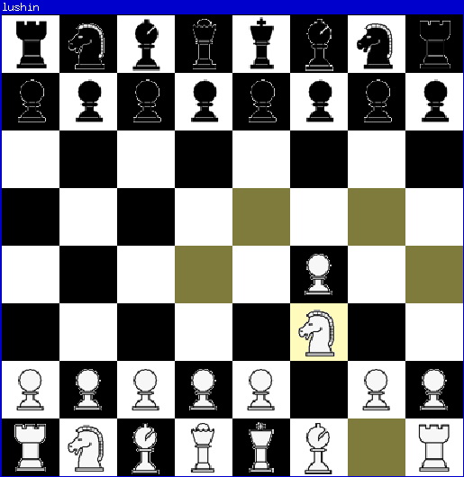

lushin
=====

A very rudimentary chess game I hacked together for fun. Named after
[Aleksandr Ivanovich Luzhin](https://en.wikipedia.org/wiki/The_Defense).

Please forgive the ugly looking pieces. The assets are awkwardly
scaled and not really optimized for this use case.

Dependencies and Building
-------------------------

On Debian, install `build-essential` `libsdl2-dev`
`libsdl2-image-dev`.  Then run `make`.

Credit
------

Art of the chest pieces in the public domain, taken from
https://opengameart.org/content/chess-pieces-and-a-board.
Thank you!
